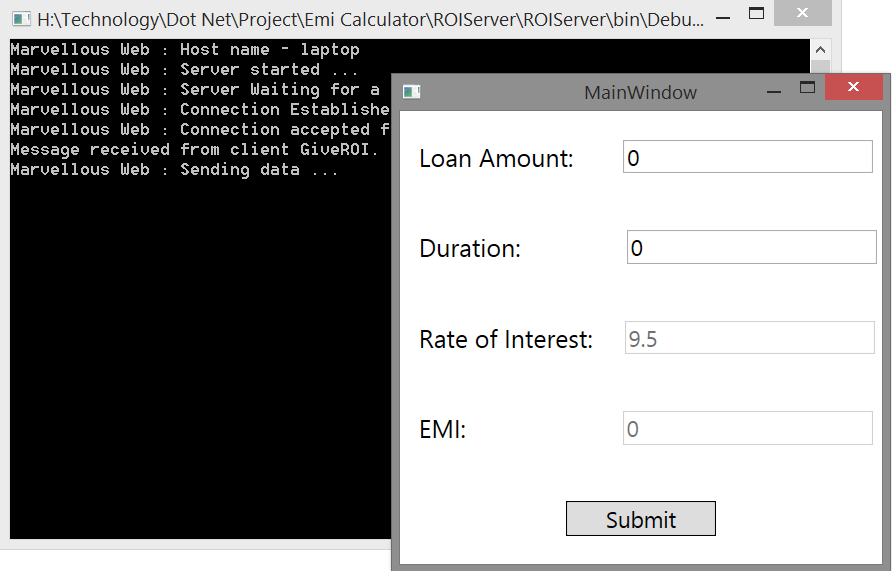
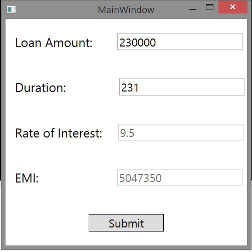

# EMI Calculator

This project is demonstration of Client-Server Application.

This Application is use to calculate EMI. ROI value is fetch from the server.

- __Framework:__ Dot Net.
- __Front End:__ Windows Presentation Foundation (WPF)
- __Back End:__ C#.
- __Platform:__ Windows.

---

## Features

- Socket Programming.
- Server fetch ROI value from XML. So if we change the value in XML Then change will reflect to client.

---
## Project ScreenShot

1. First Look of EMI Calculator.

---

2. EMI Calculation

---
---